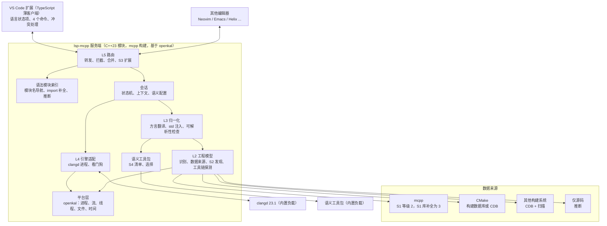

# lsp-mcpp：编译器无关的 C++ 模块统一方案设计

日期：2026-09-13（v0.4 于 2026-09-14 合入四轮 review 决策）
状态：**设计方案 v0.4**；第一版实现见 Sunrisepeak/lsp-mcpp-private#1，实测结果记在第 1.3 节
关联文档：
- 调研综述：[2026-09-13-cxx-modules-landscape-research.md](2026-09-13-cxx-modules-landscape-research.md)
- 规范草案（S1 与 S2 正文）：[2026-09-13-cxx-module-build-database-ide-profile-spec.md](2026-09-13-cxx-module-build-database-ide-profile-spec.md)
- 本地实测：[2026-09-13-cxx-modules-lsp-experiments.md](2026-09-13-cxx-modules-lsp-experiments.md)
- 原型脚本：[assets/2026-09-13-modules-lsp-spike/](assets/2026-09-13-modules-lsp-spike/)

## 目录

- **第一部分　目标、对标与决策**：0 结论先行 · 1 核心目标 · 2 对标其他语言 · 3 决策记录 · 4 问题、范围与平台矩阵 · 5 方案选择
- **第二部分　规范设计**：6 规范体系 · 7 S1 与 S2 · 8 S3 LSP 模块扩展 · 9 S4 语义工具包约定 · 10 演进与治理
- **第三部分　实现架构**：11 架构总览 · 12 服务端设计 · 13 关键流程 · 14 工程模型与归一化 · 15 引擎与负载 · 16 VS Code 扩展 · 17 分发与 xlings 生态 · 18 日志、配置与安全
- **第四部分　项目结构与工程化**：19 仓库结构 · 20 构建、测试与发布
- **第五部分　计划**：21 路线图 · 22 风险与缓解 · 23 待决问题 · 附录 A 术语

---

# 第一部分　目标、对标与决策

## 0. 结论先行

lsp-mcpp 要让 C++ 模块代码在任何编译器、任何平台、甚至没有编译器的机器上，都获得“装上就能用”的跳转、补全、悬停与引用。

| 方面 | 设计 |
|---|---|
| 体验 | 一个扩展，一体打包，零必需设置，正常情况下零弹窗；状态只出现在 VS Code 的语言状态项里 |
| 规范 | 四份规范各管一件事：统一模块描述（S1）、发现协议（S2）、LSP 模块扩展（S3）、语义工具包约定（S4）。S1、S2 走行业标准轨道，字段兼容 P2977R2 |
| 引擎 | 锁定 clangd 23.1 作为唯一语义引擎，lsp-mcpp 负责把任何编译器的工程归一化成 clangd 能正确理解的输入 |
| 无编译器 | 内置只含头文件与 std 模块源码的语义工具包，三平台统一使用与 clangd 同版本的 libc++ |
| 服务端 | C++23 全模块，mcpp 构建；平台层基于 openkal，一台主机交叉构建全部平台的静态二进制 |
| 分发 | 一套可搬移的发布产物，两个渠道：按平台的一体化 VS Code 扩展包，以及 xlings |
| 工程 | 规范放 `specs/`，设计文档放 `.agents/docs/`，与一致性测试、服务端、扩展同仓；上游贡献放到最后 |

**核心依据：**

| 依据 | 要点 | 出处 |
|---|---|---|
| 归一化可行 | GCC Linux、Clang Linux、GCC MinGW 三种构建的原始数据库在 clangd 中 9 项检查全失败；归一化后都通过 8 项 | 实验 E6、E14 |
| 无编译器可行 | 清空 PATH、去掉构建系统后，Linux 与 Windows 语义的 libc++ 工具包都通过 8 项 | 实验 E15、E16 |
| 一体打包可行 | 裁剪后 Linux 负载约 27 MB；微软 C/C++ 扩展的 Linux 包约 134 MB | 实验 E16；调研第 8 节 |
| 唯一失败项由我们补 | 9 项中唯一失败的是 import 语句中模块名的跳转，由 lsp-mcpp 的语法模块索引提供 | 实验 E6 |
| 规范有空位 | P2977 只是提案且无推进载体；EcoStd 中 P2977 与 P1689 的移植都是空位 | 调研第 4 节 |

需要你 review 决定的问题见第 23 节。

## 1. 核心目标

### 1.1 四个核心目标

| 目标 | 含义 |
|---|---|
| **无感** | 装上就能用，不需要知道用了什么编译器，没有编译器也能用；平时看不到多余的东西，只在必须由用户决定时才开口 |
| **跨平台一致** | Linux、Windows、macOS 上功能与行为一致；同一套一致性测试在三个平台得到相同结果 |
| **简洁优雅** | 用户侧只有一个扩展、一个状态项、极少命令；架构上只有一个引擎、一个模型、一条数据流；工程上一份源码、一个编译器、一套产物 |
| **规范级** | 规范自包含、版本化、带 Schema 与一致性测试；参考实现与规范同步演进，最终进入行业标准流程 |

### 1.2 体验原则

1. **安装即用。** 安装扩展后不需要安装编译器、clangd 或任何工具，也不需要任何设置。
2. **默认沉默。** 正常路径下不弹通知、不自动打开面板或引导页、不新增常驻状态栏项。
3. **只问必须问的，每件事最多问一次。** 第一版只有两种情况会询问：与其他 C++ 扩展冲突；macOS 缺少 Command Line Tools。
4. **不留痕。** 不在用户工程目录写文件；缓存、引擎数据库、索引都放在用户缓存目录。唯一例外是用户同意关闭冲突扩展时写入工作区设置。
5. **懒激活。** 只在打开 C++ 文件或工作区包含 C++ 工程标志时激活。
6. **可解释。** 任何降级都能在语言状态项的悬停中看到原因，并附一个修复动作。
7. **一致。** 同一工程在三个平台上打开，得到相同的模块语义与相同的界面。

### 1.3 可度量的目标

“当前依据”是第一版实现（PR #1）的实测结果，测量方法与原始数据见实施方案 [2026-09-14-lsp-mcpp-v1-usable-plan.md](2026-09-14-lsp-mcpp-v1-usable-plan.md) 第 10 节。

| 目标 | 指标 | 目标值 | 当前依据 |
|---|---|---|---|
| 无感 | 有编译器的工程首次打开时的弹窗数 | 0 | VS Code 端到端测试在三个平台断言扩展发起的通知、面板、页面为 0 |
| 无感 | 常驻状态栏项、自动打开的面板或页面 | 0 | 同上；语言状态项恰好一个 |
| 无感 | 写入用户工程目录的文件数 | 0，冲突处理经同意除外 | 服务端只写缓存目录。mcpp 的 `emit build-database`（mcpp#636，暂以模拟生产方验证）与 CMake、编译数据库来源的夹具断言工作区不变；尚不支持该命令的 mcpp 版本由 `--configure-only` 写入 `compile_commands.json` 与 `target/`，状态中给出提示 `producer-writes-project` |
| 无感 | 必需设置项 | 0 | 端到端测试不做任何设置 |
| 无感 | 首次打开到可跳转，示例工程冷启动 | ≤ 5 秒 | 开发机（i9-13900K）2.1–2.5 秒，限定 2 至 32 个核心结果相近；CI 机器三次中位数 Linux 5.5 秒、macOS 4.4 秒、Windows 8.5 秒（4、3、4 个虚拟核心）。171 个模块的 mcpp 仓库首次跨模块跳转在开发机上 25–26 秒、CI 机器上 125 秒：首次跳转要等所导入的整个模块闭包构建完成，这个指标不适用于大工程的冷启动 |
| 无感 | 温启动到可跳转 | ≤ 1 秒 | 开发机 0.8 秒；CI 机器三次中位数 Linux 2.0 秒、macOS 1.9 秒、Windows 2.9 秒；mcpp 仓库在开发机上 4.9 秒。剩余耗时主要在 clangd 为每个翻译单元串行扫描并校验所导入模块的缓存 BMI，服务端无法绕过（第 15.1 节） |
| 跨平台 | 覆盖的组合 | 7 种构建组合 + 3 种无编译器组合 | P1–P7 与 K1–K3 都有在对应主机上端到端运行的夹具 |
| 跨平台 | 三平台一致性测试结果 | 完全相同 | 与平台无关的夹具（`inferred`、`untrusted`、`multi-root`、`timing`）在三个主机上结果相同；其余夹具按平台所特有的组合运行 |
| 简洁 | 可选设置项 | ≤ 4 | 第 16.4 节 |
| 简洁 | 命令面板命令 | ≤ 4 | 第 16.3 节 |
| 简洁 | 扩展包负载体积（压缩后的 VSIX） | 约 30 MB 量级 | Linux x64 31.3 MB，macOS arm64 28.1 MB，Windows x64 36.4 MB |
| 规范级 | 规范规则与一致性用例的对应 | 每条规则至少一个用例 | S1–S4 共 144 条规则全部有证据（`conformance/traceability.json`，由 `specs/tools/validate.py` 检查），其中 10 条为说明原因的人工条目 |

## 2. 对标其他语言的体验

完整对比与来源见调研第 8 节，这里只列结论。

| 语言 | 用户还要装什么 | 服务端怎么来 | 首次提示 | 常驻界面 |
|---|---|---|---|---|
| TypeScript | 无 | VS Code 内置 | 无 | 语言状态项 |
| Java（Red Hat） | 无，扩展内置 JRE | 按平台内置 | 无 | 语言状态项 |
| Rust | rustup 与工具链 | 按平台内置 | 通常无 | 状态栏 |
| Python | 解释器 | 内置 | 找不到解释器时提示 | 语言状态项 |
| Go | Go 工具链 | 首次安装 gopls | 缺工具时提示 | 状态栏 |
| Swift | 工具链，可在编辑器内经 Swiftly 安装 | 随工具链 | 切换版本提示 | 状态栏 |
| C/C++ 现状 | 编译器，CMake 工程还要 CMake Tools | 内置或下载 clangd | 配置编译器路径、选择 kit、缺编译数据库、下载确认 | 多个状态栏项 |
| **lsp-mcpp 目标** | **无** | **按平台一体内置** | **无** | **语言状态项** |

lsp-mcpp 采用的做法：

- **像 TypeScript 与 Java 一样安装即用。** 服务端、clangd、标准库工具包全部内置，运行时不下载任何东西。
- **比 Rust、Go、Swift 再进一步。** 它们要求先装工具链；lsp-mcpp 在没有编译器的机器上也能提供完整模块语义。
- **像 TypeScript、Python、Java 一样只用语言状态项。** 不占常驻状态栏，只在打开 C++ 文件时出现。
- **像 rust-analyzer 一样分开“基线”与“真实工具链”。** 扩展内置的 clangd 与工具包是基线；用户真实的编译器由构建系统或 xlings 管理，lsp-mcpp 发现后自动切换过去。
- **像 clangd 扩展一样主动处理冲突，但只问一次。**
- **避开 C/C++ 现状的全部痛点。** 不需要配置编译器路径，不需要选 kit，不需要 `compile_commands.json`。

## 3. 决策记录

| 编号 | 决策 | 日期 |
|---|---|---|
| D1 | 规范自包含，参考并兼容 P2977R2 及相关行业做法，不依赖 P2977 的标准化进度 | 2026-09-14 |
| D2 | 语义引擎锁定 clangd 23.1.x | 2026-09-13 |
| D3 | 服务端用 C++23 全模块实现、mcpp 构建，自举验证；VS Code 扩展受其 API 约束用 TypeScript，保持为薄客户端 | 2026-09-13 |
| D4 | 第一版平台：GCC 的 Linux 与 Windows（MinGW-w64），Clang 的 Linux、Windows、macOS | 2026-09-13 |
| D5 | cl.exe 与 clang-cl 两种 MSVC 风格驱动进入第一版 | 2026-09-14 |
| D6 | macOS 第一版只支持 LLVM 发行版 clang | 2026-09-14 |
| D7 | 规范与实现同仓 | 2026-09-13 |
| D8 | VS Code 扩展独立发布，mcpp-vscode 声明依赖它 | 2026-09-14 |
| D9 | 一体打包：clangd 与语义工具包内置在按平台发布的扩展包中 | 2026-09-14 |
| D10 | 发布产物与包管理走 xlings 生态 | 2026-09-14 |
| D11 | 没有编译器时默认使用 libc++ | 2026-09-14 |
| D12 | 受信任工作区中，未配置的 CMake 工程自动私有配置 | 2026-09-14 |
| D13 | 检测到其他 C++ 扩展时询问一次，并在工作区范围关闭其语言功能 | 2026-09-14 |
| D14 | 向 clangd 等上游贡献放到最后，当前聚焦实现与规范制定 | 2026-09-14 |
| D15 | 体验目标：尽量无感，一般看不到多余的东西；对标其他语言，追求跨平台与简洁优雅 | 2026-09-14 |
| D16 | 服务端平台层基于 openkal，用 mcpp 从单一主机交叉构建全部平台（采纳 review 补充；openkal 三平台实现已核对，见 12.4） | 2026-09-14 |
| D17 | 首批架构为 linux-x64、win32-x64、darwin-arm64；Linux 与 Windows 的 arm64 放到第一版之后 | 2026-09-14 |
| D18 | macOS 只做 arm64，不做 x86_64 | 2026-09-14 |
| D19 | 扩展发布者 `mcpp-community`，扩展 ID `lsp-mcpp`，显示名“C++ Modules” | 2026-09-14 |
| D20 | 规范文本与代码统一使用 Apache-2.0，提交 EcoStd 时按其要求调整 | 2026-09-14 |
| D21 | 规范放在仓库根目录的 `specs/`，设计、调研、实验等文档放在 `.agents/docs/` | 2026-09-14 |
| D22 | 语义工具包命名为 `lsp-mcpp-kit`（原 Q1） | 2026-09-14 |
| D23 | 服务端核心代码不使用头文件与宏：全部是 `.cppm` 接口 + `.cpp` 实现单元，平台差异用 `if constexpr` 判断，平台常量由按目标选择的 `lspmcpp.os` 模块提供 | 2026-09-14 |
| D24 | 通用库优先复用 mcpp 生态（mcpp-index）中的模块化库，不使用 compat 形态的包：JSON 用 `nlohmann.json`，命令行用 `mcpplibs.cmdline`；`boost.ut` 因 Windows 主机编译崩溃暂不采用（见 12.8、12.9） | 2026-09-14 |
| D25 | openkal 体系的问题分两类处理：缺陷级别直接向对应仓库提 PR 修复；需求级别只记录，不改动 openkal 规范（见 12.9） | 2026-09-14 |
| D26 | clang++ 构建 MSVC ABI（P5）、clang-cl（P6）与 MSVC STL 的 `import std` 是第一版必须项，各有 Windows 主机上的一致性夹具（见[第一版真实可用方案](2026-09-14-lsp-mcpp-v1-usable-plan.md)） | 2026-09-14 |
| D27 | 保留 9.3 节第 5 条：没有构建系统、检测到 Visual Studio 时自动改用 MSVC 语义 | 2026-09-14 |
| D28 | 暂不发布预发布版本，可用性以本地与 CI 验证为准 | 2026-09-14 |

## 4. 问题、范围与平台矩阵

### 4.1 要解决的问题

| 子问题 | 表现 | 证据 |
|---|---|---|
| 物理层分裂 | BMI 格式、BMI 定位参数、依赖扫描输出、接口识别规则、std 模块来源，三家编译器各不相同 | 调研第 2 节 |
| 数据通道不足 | `compile_commands.json` 没有模块图，模块场景下条目不可独立重放，GCC 方言参数会让 Clang 系工具直接报错 | 实验 E1、E4、E11 |
| 引擎锁定编译器 | clangd 只理解 Clang 命令且要求 BMI 版本一致；MSVC IntelliSense 只读 IFC；读取构建 BMI 还会陈旧 | 实验 E6、E8 |
| 使用门槛高 | 需要编译器、构建数据库和手工配置，没有编译器就没有任何语言服务 | 调研第 8 节 |

### 4.2 非目标

- 不实现新的 C++ 编译器前端。
- 不定义可移植的 BMI 格式，也不读取构建产出的 BMI 做语义分析。
- 不做构建系统，不负责链接与代码生成。
- 第一版不支持 header units、Clang header modules（module map）与 Apple Clang。

### 4.3 第一版平台矩阵

**构建组合：**

| 编号 | 构建组合 | 参数风格 | 标准库模块来源 | 验证状态 |
|---|---|---|---|---|
| P1 | GCC，Linux | GNU | libstdc++ `bits/std.cc` | 实测（E6） |
| P2 | GCC MinGW-w64，Windows | GNU | MinGW libstdc++ `bits/std.cc` | Linux 主机交叉目标实测（E14），待 Windows 主机 |
| P3 | LLVM Clang，Linux | GNU | libc++ `std.cppm` | 实测（E6） |
| P4 | LLVM Clang，macOS | GNU | LLVM libc++ `std.cppm` + macOS SDK | 待 macOS 主机 |
| P5 | LLVM clang++，Windows MSVC ABI | GNU | MSVC STL `std.ixx` | 待 Windows 主机（mcpp 构建已支持） |
| P6 | clang-cl，Windows | MSVC | MSVC STL `std.ixx` | 待 Windows 主机 |
| P7 | cl.exe，Windows | MSVC | MSVC STL `std.ixx` | 待 Windows 主机 |

**无编译器组合（语义工具包，统一为 libc++ 23.1）：**

| 编号 | 平台 | 工具包内容 | 验证状态 |
|---|---|---|---|
| K1 | Linux | libc++ + glibc 与内核头文件 | 实测（E15、E16） |
| K2 | Windows | libc++ + MinGW-w64 UCRT 头文件（来自 llvm-mingw） | Linux 主机实测（E16），待 Windows 主机 |
| K3 | macOS | libc++；C 库头文件来自用户的 Command Line Tools | 待 macOS 主机 |

**首批架构：** linux-x64、win32-x64、darwin-arm64。macOS 不做 x86_64。clangd 官方只发布 Linux x64、Windows x64 与 macOS 通用二进制；Linux 与 Windows 的 arm64 需要自建 clangd，放到第一版之后。

### 4.4 成功标准

| 编号 | 标准 | 验证方式 |
|---|---|---|
| SC1 | P1–P7 与 K1–K3 上，一致性用例全部检查通过，其中模块名跳转由 lsp-mcpp 提供 | 服务端一致性测试 |
| SC2 | 在没有编译器的干净 Linux、Windows，以及只装了 Command Line Tools 的 macOS 上，只装扩展、不做配置，即可跨模块跳转、补全、悬停、引用 | VS Code 端到端测试 |
| SC3 | 有编译器与构建系统的工程，首次打开时弹窗数、常驻状态栏项、自动打开的面板都为零 | 端到端测试断言 |
| SC4 | 温启动不重新构建 std 模块 | clangd 日志与计时 |
| SC5 | 未保存的模块接口修改在防抖间隔后反映到导入方 | 探针 C7 |
| SC6 | mcpp 输出等级 2 的 S1 文档，经 S1 库补全为等级 3；CMake 构建数据库经适配达到等级 2 | Schema 校验 + 一致性测试 |
| SC7 | lsp-mcpp 仓库与 mcpp 仓库在 VS Code 中可完整导航 | 自举与大工程基准 |
| SC8 | 服务端全部平台的二进制由一台 Linux 主机交叉构建，并在各平台原生通过测试 | CI |

## 5. 方案选择

六种候选方案已在前两轮 review 中比较并确认，这里保留每种方案的做法与结论。

| 方案 | 做法 | 结论 |
|---|---|---|
| A 现状 | 构建工具直接输出 clangd 兼容数据库，要求用户换 LLVM | 只是基线：不是编译器无关，PCM 版本锁定，修改后陈旧 |
| **B 代理 + 归一化** | lsp-mcpp 归一化工程模型，驱动原版 clangd，自己补模块级功能 | **第一版实现形态**：实测可行，成本低，复用成熟语义 |
| C1 上游 clangd | 把模块提供者、多变体、共享缓存等能力贡献进 clangd | 第一版之后，**放在最后** |
| C2 clice | 用 clice 替代 clangd | 引擎层保持可插拔，之后评估 |
| D 自研前端 | 自研 C++ 语义前端 | 拒绝完整版本，只保留语法模块索引子集 |
| E 原生 BMI | 读取各编译器 BMI | 拒绝作为主路径，远期可作 MSVC 权威模式 |
| F 纯规范 | 只写规范不做实现 | 拒绝，规范必须与参考实现同步 |

---

# 第二部分　规范设计

## 6. 规范体系

### 6.1 四份规范

| 编号 | 规范 | 解决的问题 | 读者 | 轨道 |
|---|---|---|---|---|
| S1 | 统一模块描述（工作名 C++ Build Database IDE Profile） | 构建工具如何把模块图、工具链与语义选项交给 IDE | 构建工具与 IDE 作者 | 行业标准轨道 |
| S2 | 发现协议 | IDE 如何向构建工具要到 S1 文档，并知道何时刷新 | 构建工具与 IDE 作者 | 行业标准轨道，与 S1 一同提交 |
| S3 | LSP 模块扩展 | 语言服务器如何向编辑器暴露模块状态、模块图与上下文 | 编辑器扩展与客户端作者 | 项目接口规范 |
| S4 | 语义工具包约定 | 不含编译器的标准库头文件包如何描述自己，引擎如何使用 | 工具包打包者与服务端 | 项目接口规范 |

### 6.2 设计原则

1. **各管一件事。** 数据格式、获取方式、编辑器接口、工具包布局互不重叠，任何一份可以单独演进。
2. **沿用行业命名。** S1 字段沿用 P2977 与 P1689，标准库模块清单沿用 P3286，编辑器接口沿用 LSP 的写法与协商方式。
3. **一致性测试是规范的可执行部分。** 每条规则至少对应一个用例，规范与用例同一次提交修改。
4. **先在实现中稳定，再提交标准组织。** S1、S2 在 lsp-mcpp 与 mcpp 两个实现上验证后提交 EcoStd；S3、S4 作为项目接口公开发布，不急于标准化。

### 6.3 规范之间的关系

```
构建工具（mcpp、CMake 等）
    │  S2 发现协议：请求与进度
    ▼
S1 统一模块描述文档 ─── 引用 ──→ P3286 标准库模块清单
    │
    ▼
lsp-mcpp ─── 读取 ──→ S4 语义工具包（没有编译器时）
    │  S3 LSP 模块扩展 + 标准 LSP
    ▼
编辑器（VS Code 扩展、其他 LSP 客户端）
```

## 7. S1 与 S2

正文见[规范草案](2026-09-13-cxx-module-build-database-ide-profile-spec.md)，要点如下。

| 要点 | 内容 |
|---|---|
| 定位 | 自包含定义；合规文档同时是合法的 P2977R2 文档；可降级导出为 `compile_commands.json` |
| 工具链描述 | `family` 决定参数方言；`version`、`build-id`、`driver`、`target`、`sysroot`；`stdlib` 含名称与 P3286 清单路径；`config-files` 记录隐式配置 |
| 单元角色 | `module-interface`、`module-partition-interface`、`module-partition-implementation`、`module-implementation`、`non-module`、`unknown`，`header-unit` 保留；依据源码内容判定 |
| 结构化语义选项 | 语言标准、扩展方言、有序宏序列、四类包含目录、强制包含、异常、RTTI、按编译器家族分组的原始语义参数 |
| 解析规则 | 本 set → 可见 set → set 级外部模块元数据 → 工具链标准库清单；歧义与无法解析必须报告 |
| BMI 立场 | BMI 路径只是构建事实；消费方默认不得依赖它做语义分析 |
| 一致性等级 | 生产方：1 Graph、2 IDE、3 Structured、4 Live；消费方必须忽略未知字段并支持降级 |
| S2 发现协议 | 子进程 + stdin 一个 JSON 请求 + stdout 逐行 JSON 的进度与结果，结果附带需要监视的路径 |
| 版本 | 规范语义化版本；厂商扩展放在各层 `ide.extensions` |

## 8. S3 LSP 模块扩展

### 8.1 原则

1. 标准 LSP 能表达的一律用标准请求。模块名跳转、import 补全、模块名悬停、大纲都走标准请求。
2. 自定义能力通过 `initialize` 中的 `experimental.cxxModules` 协商，客户端未声明时服务端不发送。
3. 所有自定义消息使用 `cxxModules/` 前缀，用 TypeScript 接口描述，写法与 LSP 规范一致。
4. 协商版本只增不改；新增字段一律可选。

### 8.2 能力协商

```ts
// 客户端 → 服务端：InitializeParams.capabilities.experimental
interface ClientCxxModulesCapabilities {
  cxxModules?: {
    version: 1;
    status?: boolean;     // 客户端会展示 cxxModules/status
    graph?: boolean;      // 客户端能展示模块图
    contexts?: boolean;   // 客户端能提供上下文选择
  };
}

// 服务端 → 客户端：InitializeResult.capabilities.experimental
interface ServerCxxModulesCapabilities {
  cxxModules?: {
    version: 1;
    databaseSpec: string; // 支持的 S1 版本范围，例如 ">=0.2 <1"
  };
}
```

### 8.3 cxxModules/status（通知，服务端发往客户端）

```ts
interface CxxModulesStatusParams {
  state: "starting" | "loading" | "preparing" | "ready" | "degraded" | "error";
  project: {
    root: DocumentUri;
    source: "mcpp" | "cmake" | "build-database" | "compile-commands" | "inferred";
    level?: 1 | 2 | 3 | 4;        // S1 一致性等级
  };
  profile: SemanticProfile;        // 当前默认上下文的语义配置
  engine: { name: "clangd"; version: string };
  progress?: { done: number; total: number };
  issues?: CxxModulesIssue[];      // 降级原因；空表示没有
}

interface SemanticProfile {
  kind: "build-toolchain" | "semantic-kit";
  compiler?: string;               // 例如 "gcc 16.1.0"
  stdlib: string;                  // 例如 "libstdc++ 16.1.0" 或 "libc++ 23.1.0"
  target: string;                  // 例如 "x86_64-linux-gnu"
}

interface CxxModulesIssue {
  code: "unresolved-module" | "ambiguous-module" | "engine-timeout" | "engine-crashed"
      | "toolchain-not-found" | "sdk-missing" | "untrusted-workspace" | string;
  message: string;
  command?: Command;               // 可选的修复动作
}
```

### 8.4 其他请求

```ts
// cxxModules/graph
interface CxxModulesGraphParams { context?: string }
interface CxxModulesGraph {
  modules: { name: string; external: boolean;
             units: { uri: DocumentUri; role: ModuleUnitRole }[] }[];
  imports: { from: DocumentUri; module: string; range: Range }[];
}
type ModuleUnitRole = "module-interface" | "module-partition-interface"
  | "module-partition-implementation" | "module-implementation" | "non-module" | "unknown";

// cxxModules/moduleInfo
type CxxModulesModuleInfoParams = TextDocumentPositionParams | { name: string; context?: string };
interface CxxModulesModuleInfo {
  name: string;
  providers: { uri: DocumentUri; role: ModuleUnitRole; set: string }[];
  resolvedFrom: "set" | "visible-set" | "module-metadata" | "stdlib";
  ambiguous: boolean;
}

// cxxModules/contexts 与 cxxModules/setContext
interface CxxModulesContextsParams { textDocument: TextDocumentIdentifier }
interface CxxModulesContexts {
  current: string;
  available: { id: string; label: string; profile: SemanticProfile }[];
}
interface CxxModulesSetContextParams { textDocument: TextDocumentIdentifier; context: string }
// 返回 null；随后服务端重写引擎数据库并发送新的 cxxModules/status
```

### 8.5 用标准 LSP 实现的模块功能

| 功能 | 标准请求 | 由谁回答 |
|---|---|---|
| 模块名跳转到主接口单元或分区声明 | `textDocument/definition` | 语法模块索引 |
| import 补全：模块名、同模块分区 | `textDocument/completion` | 语法模块索引 |
| 模块名悬停：提供者、角色、语义配置 | `textDocument/hover` | 语法模块索引 |
| 模块声明作为大纲顶层节点 | `textDocument/documentSymbol` | 与 clangd 结果合并 |
| 按模块名搜索 | `workspace/symbol` | 与 clangd 结果合并 |
| 无法解析、歧义、跨模块导入分区 | `textDocument/publishDiagnostics` | 语法模块索引，来源标为 lsp-mcpp |
| 构建描述文件变化 | 服务端动态注册 `workspace/didChangeWatchedFiles` | 编辑器负责监视 |

## 9. S4 语义工具包约定

### 9.1 布局

```
<工具包根目录>/
  kit.json                 工具包清单
  licenses/                上游许可证文本
  ...                      头文件、std 模块源码与模块清单，位置由 kit.json 声明
```

### 9.2 kit.json

| 字段 | 类型 | 要求 | 说明 |
|---|---|---|---|
| `kit-version` | integer | MUST | 清单格式版本，当前为 1 |
| `name` | string | MUST | 例如 `libcxx-23.1.0-x86_64-w64-mingw32` |
| `target` | string | MUST | 目标三元组 |
| `stdlib` | object | MUST | `name`、`version`、`module-metadata`（P3286 形状清单的相对路径） |
| `system-include-directories` | string[] | MUST | 按顺序传给引擎的系统头目录，相对工具包根 |
| `sysroot` | string 或 null | MAY | 相对工具包根的 sysroot |
| `arguments` | string[] | MAY | 额外引擎参数，例如 `-nostdinc++` |
| `requires` | object[] | MAY | 外部前提，例如 `{ "kind": "macos-sdk" }` |
| `licenses` | string[] | MUST | 许可证文件相对路径 |

示例（按实验 E16 的 Windows 语义工具包整理，补上了实验清单中没有的 `name` 与 `licenses`）：

```json
{
  "kit-version": 1,
  "name": "libcxx-23.1.0-x86_64-w64-mingw32",
  "target": "x86_64-w64-mingw32",
  "stdlib": { "name": "libc++", "version": "23.1.0",
              "module-metadata": "x86_64-w64-mingw32/lib/libc++.modules.json" },
  "system-include-directories": ["generic-w64-mingw32/include/c++/v1", "generic-w64-mingw32/include"],
  "sysroot": null,
  "arguments": ["-nostdinc++", "-nostdlibinc"],
  "licenses": ["licenses/LLVM-LICENSE.TXT", "licenses/mingw-w64-COPYING"]
}
```

### 9.3 规则

1. 工具包只含数据文件，不含任何可执行文件。
2. 模块清单与 std 模块源码必须保持相对位置，因为清单用相对路径引用源码。
3. 工具包的 libc++ 版本与锁定的 clangd 版本一致。
4. macOS 工具包声明 `requires: [{ "kind": "macos-sdk" }]`，C 库头文件取自用户已安装的 Command Line Tools，因为 Apple 许可不允许分发 SDK。
5. Windows 工具包提供 MinGW-w64 运行时语义；MSVC STL 依赖 Visual Studio 自带的 VCRuntime 与 Windows SDK，不能打包。检测到 Visual Studio 时自动改用 MSVC 语义。

### 9.4 第一版的三个工具包

| 编号 | 内容来源 | 实测体积（压缩） |
|---|---|---|
| K1 Linux | LLVM 23.1 的 libc++ 头文件与 std 模块源码；glibc 与 Linux 内核头文件 | 约 3.7 MB（以 LLVM 22.1.8 测得） |
| K2 Windows | llvm-mingw 23.1.0 的 libc++ 与 MinGW-w64 UCRT 头文件，去掉 `.idl`、`.tlb`、`.def` | 约 10.4 MB |
| K3 macOS | LLVM 23.1 的 libc++ 头文件与 std 模块源码 | 待测，预计小于 K1 |

## 10. 演进与治理

| 事项 | 做法 |
|---|---|
| 版本 | 四份规范各自语义化版本；仓库标签 `spec-s1-vX.Y.Z` 等；服务端声明支持的规范版本范围 |
| 兼容 | MINOR 只新增可选字段；MAJOR 变更需要迁移说明与一致性用例更新 |
| 修改流程 | 规范正文、Schema、一致性用例同一次提交；CI 校验三者一致 |
| 实现数量 | S1 至少两个生产方（mcpp、CMake 适配）与一个消费方（lsp-mcpp）通过一致性测试后，才发布 1.0 |
| 标准化 | S1、S2 的 1.0 发布后提交 EcoStd，并邀请 P2977、P3286 作者参与，避免形成竞争格式 |
| 许可 | 规范文本与代码统一使用 Apache-2.0，提交 EcoStd 时按其要求调整 |

---

# 第三部分　实现架构

## 11. 架构总览

### 11.1 分层



| 层 | 职责 | 输入 | 输出 |
|---|---|---|---|
| 平台层 | 进程、流、线程、文件、时间，全部基于 openkal | — | 统一的平台接口 |
| L2 工程模型 | 识别工程、加载或推断模型、探测工具链 | 构建工具输出、S2 发现、源码扫描 | 内存中的 S1 模型 |
| L3 归一化 | 按上下文生成引擎输入 | S1 模型、语义工具包 | 引擎专用编译数据库 |
| L4 引擎适配 | 管理 clangd 进程与请求 | 引擎数据库、LSP 请求 | 语义结果 |
| L5 路由 | 面向编辑器的 LSP 服务 | 编辑器请求 | 合并后的响应、诊断与 S3 通知 |

### 11.2 进程模型

| 进程 | 生命周期 | 说明 |
|---|---|---|
| lsp-mcpp | 编辑器会话 | 持有全部状态；单一静态二进制 |
| clangd | 每个工作区上下文一个 | 版本锁定；崩溃或挂起时退避重启并重放打开的文档 |
| 数据来源子进程 | 短 | mcpp 发现命令、CMake 私有配置、编译器查询 |

隔离构建工具与语义引擎进程，是 rust-analyzer、Roslyn、JDT LS 的共同经验。

## 12. 服务端设计

### 12.1 模块划分

模块名以 `lspmcpp.` 开头，`src/<目录>/` 与模块层级一一对应，依赖只能自上而下。

| 层 | 模块 | 职责 |
|---|---|---|
| 基础 | `lspmcpp.base` | 错误约定（`std::expected`）、日志、取消令牌 |
| 基础 | mcpp-index 的 `nlohmann.json`（不自写 JSON 模块） | JSON 读写，见 12.8 |
| 平台 | `lspmcpp.platform.process` | 基于 `openkal.process`：启动子进程、双向流、等待与终止、进程组 |
| 平台 | `lspmcpp.platform.fs` | 基于 `openkal.fs`：路径与 URI 规范化、原子写入 |
| 平台 | `lspmcpp.platform.task` | 基于 `openkal.task` 与 `openkal.time`：线程、消息队列、定时器 |
| 平台 | `lspmcpp.platform.dirs` | 基于 `openkal.env`：用户缓存目录、扩展负载目录 |
| 协议 | `lspmcpp.lsp.protocol` | 由 LSP 3.18 官方 metaModel.json 生成的类型 |
| 协议 | `lspmcpp.lsp.jsonrpc` | 消息帧、请求表、取消、超时 |
| 协议 | `lspmcpp.lsp.connection` | 以子进程运行的 LSP 对端：帧读写线程、标准错误行 |
| 规范 | `lspmcpp.spec.database` | S1 数据结构、校验、编解码、导出 `compile_commands.json` |
| 规范 | `lspmcpp.spec.discovery` | S2 发现协议客户端 |
| 规范 | `lspmcpp.spec.kit` | S4 清单读取与校验 |
| 工程 | `lspmcpp.project.scan` | 词法模块扫描，推断与语法索引共用 |
| 工程 | `lspmcpp.project.detect` | 工程识别 |
| 工程 | `lspmcpp.project.mcpp`、`.cmake`、`.compdb`、`.infer` | 各数据来源，统一产出 S1 模型 |
| 工具链 | `lspmcpp.toolchain.discover` | 发现编译器：PATH、xlings、mcpp、vswhere、Homebrew LLVM |
| 工具链 | `lspmcpp.toolchain.probe` | 驱动查询与缓存 |
| 归一化 | `lspmcpp.normalize.gnu`、`.msvc` | 两种参数方言的解析与翻译 |
| 归一化 | `lspmcpp.normalize.plan` | 上下文选择、std 注入、可解析性检查、生成引擎数据库 |
| 引擎 | `lspmcpp.engine`、`lspmcpp.engine.clangd` | 引擎接口；clangd 进程、看门狗、版本能力表 |
| 索引 | `lspmcpp.index.modules` | 语法模块索引与模块级功能 |
| 服务 | `lspmcpp.server.session` | 工作区会话、状态机、S3 状态通知 |
| 服务 | `lspmcpp.server.router` | 请求路由与结果合并 |
| 服务 | `lspmcpp.server.documents`、`.payload`、`.cli` | 打开的文档与增量修改；负载与工具包定位；命令行 |
| 工程 | `lspmcpp.project.provider` | 数据来源共用的执行、扫描与探测上下文 |
| 平台 | `lspmcpp.platform.env`、`.stdio` | 环境变量与可执行文件查找；标准输入输出字节流 |
| 工具 | `src/tools/lspgen.cpp`、`src/tools/conformance.cpp` | 协议生成器与一致性运行器，两个独立可执行文件 |

### 12.2 命令行

| 命令 | 用途 |
|---|---|
| `lsp-mcpp` | 以 stdio 运行语言服务器 |
| `lsp-mcpp check <file>` | 不启动编辑器，输出工程模型、语义配置与诊断，用于排障与 CI |
| `lsp-mcpp model [--format json]` | 输出 S1 文档，兼作转换器 |
| `lsp-mcpp model --export compile-commands` | 按 S1 规则导出 `compile_commands.json` |
| `lsp-mcpp version` | 服务端版本、支持的规范版本、内置负载版本 |

### 12.3 并发模型

openkal 不提供 poll 或 select 这类多路复用，设计据此选择最简单的模型：

1. **主线程**运行事件循环，只做一件事：从消息队列取消息并修改会话状态。状态只在主线程修改，不需要锁。
2. **读线程**：编辑器 stdin 一个、每个 clangd 的 stdout 一个，阻塞读取完整消息后放入队列。
3. **工作线程池**：源码扫描、解析大型数据库、编译器查询，完成后把结果放入队列。
4. **定时器**：不单独开线程。主线程取消息时以最近的截止时间为超时（请求看门狗、防抖、退避重启、模型加载上限），醒来后统一处理到期项。
5. **文件变化**：请编辑器代为监视，通过 LSP 的 `workspace/didChangeWatchedFiles` 通知；编辑器不支持动态注册时，工作线程每 2 秒比较监视范围内文件的大小与修改时间，变化转成同样的通知进入队列。监视范围包括构建描述文件、源文件，以及生产方在数据库的 `watch` 中列出的输入（S2 第 5 节）：列出的输入变化时重新加载模型；重新加载的结果与当前模型相同时只替换模型、不重建索引与计划；生产方这次失败时保留上次成功的模型，状态降为 degraded 并带问题项 `model-stale`。

### 12.4 平台层基于 openkal

| 需要的能力 | openkal 接口 | Linux | macOS | Windows |
|---|---|---|---|---|
| 启动子进程并与其双向通信 | `openkal.process`：`kal_process_spawn`、`kal_process_channel` | 已实现 | 已实现 | 已实现 |
| 等待子进程、带超时等待 | `kal_process_wait`、`openkal.timeout` | 已实现 | 已实现 | 已实现 |
| 线程 | `openkal.task`：`kal_task_start`、`kal_task_join` | 已实现 | 已实现 | 已实现 |
| 文件与目录 | `openkal.fs` | 已实现 | 已实现 | 已实现 |
| 时钟、环境变量、标准流 | `openkal.time`、`openkal.env`、`openkal.stream` | 已实现 | 已实现 | 已实现 |

“已实现”指三个实现仓库的源码中存在对应函数，本次只做了源码核对，尚未在各平台跑服务端原型，列入 M0。

带来的好处：

- **一份源码、一个编译器、全部平台。** 按 mcpp 的 openkal 交叉编译模型，`mcpp build --target x86_64-linux`、`aarch64-macos`、`x86_64-windows-gnu` 在同一台主机上完成。
- **可搬移的二进制。** C 库来自 openkal-musl，C++ 运行时来自 libc++，Linux 与 Windows 产物不依赖目标机器的 C 运行库；mcpp 文档实测的 Windows 产物只导入 `ntdll`、`KERNEL32`、`SHELL32`。macOS 产物的链接形态在 M0 确认。这正好满足一体打包与 xlings 分发对“可搬移”的要求。
- **不需要 asio、libuv 这类跨平台库。** 平台差异由 openkal 的三个实现承担。

约束：openkal-llvm-runtime 要求用 LLVM 编译服务端，这只影响 lsp-mcpp 自身的构建，不影响用户工程用什么编译器。

### 12.5 会话状态机

```
starting ──> loading ──> preparing ──> ready
                │             │          │
                └──────> degraded <──────┘
                              │
                            error
```

| 状态 | 含义 | 语言状态项表现 |
|---|---|---|
| starting | 启动与能力协商 | 忙碌 |
| loading | 识别工程、加载或推断模型 | 忙碌 |
| preparing | clangd 构建前置模块 | 忙碌，悬停显示进度 |
| ready | 全部功能可用 | 普通 |
| degraded | 存在问题：构建系统数据不可用而回退到推断、模块无法解析、引擎超时或崩溃、工作区不受信任。推断模式本身（没有构建系统）不算降级 | 警告，悬停显示原因与修复命令 |
| error | 只剩语法级功能 | 错误，悬停显示原因与修复命令 |

### 12.6 路由规则

| 请求类别 | 处理 |
|---|---|
| 文档同步 | 转发给 clangd，同时更新语法索引 |
| 跳转、悬停、补全 | 光标在模块名上由语法索引回答，否则转发给 clangd |
| 诊断 | 合并 clangd 与语法索引两路；诊断的 `source` 写明语义配置，例如“lsp-mcpp · gcc 16” |
| 引用、重命名、调用层级、语义高亮、inlay hints | 转发给 clangd |
| 大纲、工作区符号 | 合并两路结果 |
| S3 自定义请求 | 由会话处理 |

### 12.7 技术选型

| 事项 | 选择 |
|---|---|
| 语言与构建 | C++23 全模块，mcpp，LLVM 编译 |
| 平台层 | openkal（接口）+ openkal-linux、openkal-macos、openkal-windows（实现）+ openkal-llvm-runtime |
| LSP 类型 | 从 LSP 3.18 官方 metaModel.json 生成 |
| JSON | mcpp-index 的模块化库 `nlohmann.json`（`import nlohmann.json;`） |
| 命令行 | mcpp-index 的模块化库 `mcpplibs.cmdline`（`import mcpplibs.cmdline;`） |
| 单元测试 | 仓库内的测试支持包 `testing/`（模块 `lspmcpp.testing`），以 path dev-dependency 引入，由 `mcpp test` 发现；`boost.ut` 因 Windows 主机编译崩溃未采用（12.9 K5） |
| 并发 | 线程 + 阻塞流 + 主线程消息队列 |
| VS Code 扩展 | TypeScript + vscode-languageclient |

### 12.8 复用 mcpp 生态的模块化库

原则：

1. **先查 mcpp-index。** 需要通用能力（JSON、命令行、测试、TOML 等）时，先在 mcpp-index 中找已经提供命名模块的包，用 `import` 使用，不自己重写。
2. **只用模块化形态。** 不使用 compat 形态（以头文件方式暴露）的包，保持服务端“全模块、无头文件”的约束。
3. **必须能在 openkal 上交叉构建。** 选用前在 linux-x64、`x86_64-windows-gnu`、`aarch64-macos` 三个目标上各构建一次；任何一个目标失败都不引入，并按 12.9 处理根因。
4. **生态里缺的通用能力。** 属于 mcpp 或 xlings 通用工具包的，先向对应仓库提 PR，CI 通过并合入后再在本项目使用；合入前本项目不自带一份临时实现。

第一版选定：

| 能力 | 包 | 版本 | 结论 |
|---|---|---|---|
| JSON | `nlohmann:json` | 3.12.0 | 采用；三个目标构建通过（依赖 12.9 的修复） |
| 命令行 | `mcpplibs:cmdline` | 0.0.2 | 采用；纯模块，三个目标构建通过 |
| 单元测试 | `boost-ext:ut` | 2.3.1 | 不采用；Linux 与交叉构建通过，Windows 主机上 clang 22.1.8 编译该模块时崩溃（12.9 K5）。测试改用仓库内约 150 行的 `lspmcpp.testing`，接口形状与 ut 相同，便于将来切回 |
| TOML | `marzer:tomlplusplus` | — | 不采用；Windows 目标构建失败（见 12.9 第 2 项），读取 `mcpp.toml` 改为调用 mcpp 自身的机器输出 |

### 12.9 openkal 体系问题的处理与记录

处理规则：

- **缺陷级别**（实现与 openkal 规范或 C++ 标准不一致、同一份源码在某个目标上构建或运行失败）：定位根因后直接向对应仓库（openkal-musl、openkal-llvm-runtime、openkal-linux/macos/windows 等）提 PR 修复，附最小复现与 CI 覆盖；PR 合入并发布、mcpp-index 收录新版本后，本项目再升级依赖。
- **需求级别**（openkal 规范目前没有的能力，例如 I/O 多路复用）：只在下表记录，不改动 openkal 规范，也不在本项目私自扩展接口；本项目按现有能力设计（例如 12.3 的线程加阻塞读模型）。

问题记录：

| 编号 | 类别 | 现象 | 根因 | 处理 |
|---|---|---|---|---|
| K1 | 缺陷 | 含标准库头文件的翻译单元（所有头文件库的模块封装都是如此，例如 `nlohmann.json`）在 Linux 目标构建通过，在 `x86_64-windows-gnu` 与 `aarch64-macos` 目标报 `no member named 'strtof_l' in the global namespace` | libc++ 的 musl 本地化支持调用 `strtof_l`、`strtod_l`、`strtold_l`、`vasprintf`，musl 只在 `_GNU_SOURCE` 下声明它们；Clang 只在 Linux 目标为 C++ 预定义 `_GNU_SOURCE`。`import std` 不暴露该问题，因为 std 模块用运行时包自己的参数编译 | 已提 PR：openkal-llvm-runtime 0.9.2 在 `__config_site` 中声明 `_GNU_SOURCE`，CI 增加两个交叉目标的 `examples/cxx` 构建；合入后向 mcpp-index 提交 0.9.2 |
| K2 | 缺陷 | `marzer:tomlplusplus` 在 `x86_64-windows-gnu` 目标报 `__mingw_aligned_malloc` 未声明 | Clang 自带的 `mm_malloc.h` 在 `__MINGW32__` 下调用 MinGW CRT 的 `__mingw_aligned_malloc`，openkal-musl 的 Windows 实现没有提供 | 已记录；本项目不依赖 tomlplusplus，暂不修复，待确认修复位置（openkal-musl 补函数，或运行时包调整 `mm_malloc.h` 路径）后再提 PR |
| K3 | 需求 | openkal 没有 poll/select 类多路复用 | 规范范围 | 只记录；服务端用线程加阻塞读（12.3） |
| K5 | 缺陷（生态，非 openkal） | `boost-ext:ut` 2.3.1 的模块 `boost.ut` 在 windows-2022 主机上以 `x86_64-windows-gnu` 为目标编译时，clang 22.1.8 在代码生成阶段崩溃（`Exception Code: 0xC0000005`），dev 与 release 配置都复现；同一命令在 Linux 主机交叉编译通过；macOS 主机（`aarch64-macos`）上所有链接了该模块的测试程序（包括不 import 它的）启动即段错误（exit 139），移除后全部通过 | 未定位。Windows 上只在 Windows 主机出现，指向 Windows 版 clang；macOS 上的崩溃发生在进程启动时，指向该模块的静态初始化与 openkal-macos 启动序列的交互 | 已记录；测试不依赖 `boost.ut`。定位到根因后向对应仓库（LLVM 或 mcpp-index 的包描述）报告 |
| K6 | 缺陷 | Windows 上所有 `std::thread` 在 join 时访问违例（`0xC0000005`）：lsp-mcpp 的线程与进程单元测试只在 windows-2022 崩溃，Wine 下复现为 `pthread_join` 读取被截断的指针 | musl 为 C++ 声明的 `pthread_t` 是 `unsigned long`，在 LLP64 的 Windows 上只有 32 位，libc++ 的 `std::thread` 保存它时丢掉了线程地址的高半部分 | 已提 PR：openkal-musl 0.13.2 把该声明改为 `unsigned _Addr`（其他目标上仍是 `long`），并新增 `examples/threads-cxx` 在每个 CI 行编译期断言宽度、运行时创建并 join 线程；openkal-llvm-runtime 对 openkal-musl 的版本要求是精确的（在其旁边声明 0.13.2 会被判为不可调和），因此另提 PR：openkal-llvm-runtime 0.9.3 跟随 openkal-musl 0.13.2，`examples/cxx` 增加线程 join，macOS 与 Windows 主机任务原生运行它 |
| K7 | 缺陷 | 以 release（`-O2`）配置构建、运行在 openkal-windows 与 openkal-macos 上的程序启动即异常：Windows 上 `argv` 各参数被截去不定字节（Wine 可复现），macOS 上段错误；dev（`-O0`）配置三平台都正常，Linux 的 release 正常 | Windows 部分已定位：优化器把 openkal-windows `src/env.cpp` 里按 16 位单元计数的循环替换成 `wcslen` 调用，而链接到的是 openkal-musl 的 `wcslen`（`wchar_t` 为 32 位），命令行被两个单元一读；同一包的 `win.cpp` 在 release 下还引用了 `strlen`，而该仓库“不引用 C 运行时符号”的检查只构建 dev。macOS 部分未定位 | 已合入并发布：mcpplibs/openkal-windows#20（0.7.1，`-fno-builtin`，检查覆盖 release），mcpp-index#417；由 openkal-musl 0.13.3 与 openkal-llvm-runtime 0.9.4 携带（版本要求是精确的）。Windows 部分已在 Wine 下验证：携带这些修复的 release 构建通过 11 项进程测试与 inferred 夹具全部检查，服务端从 58.8 MB 降到 2.9 MB。macOS 部分另见 K13。负载与一致性运行器仍用 dev 配置构建，携带全部修复的运行时包在三个平台验证 release 之后再切换 |
| K8 | 缺陷（记录） | libc++ 的 `std::basic_string<wchar_t>` 在 `x86_64-windows-gnu` 上按 16 位 `wchar_t` 编译，但 `char_traits<wchar_t>::length` 调用的 `wcslen` 来自 openkal-musl（32 位），宽字符串长度会算错 | openkal-musl 在 Windows 上刻意保持 32 位 `wchar_t`（其 PATCHES.md 已说明取舍），与目标 ABI 的 16 位 `wchar_t` 不一致 | 只记录：属于 openkal-musl 的设计取舍，改动面大；lsp-mcpp 不使用宽字符串 |
| K9 | 缺陷 | macOS 上服务端的 detached 线程一结束（客户端关闭输入后的读线程、模型加载线程）进程就访问违例：`EXC_BAD_ACCESS`，停在 musl 的 `__pthread_exit`；`--no-discover` 与 `--untrusted` 下加载线程最先结束，服务端在回复 `initialize` 前退出；同一程序在 Linux 与 Windows 上正常 | musl 的 `__unmapself` 先切到所有退出线程共享的 256 字节静态栈，再发出结束线程的两个系统调用。openkal-musl 里这两个调用要经过移植层的分发、上下文表和 openkal，未优化构建在 x86_64 Linux 上实测用到共享栈之下 13,640 字节，溢出覆盖链接器放在它下面的数据。macOS 上那里是线程键表和移植层的上下文表，线程随后从被覆盖的表中取出自己的记录并跳转进去；Linux 上被覆盖的数据恰好无害 | 已合入并发布：mcpplibs/openkal-musl#32（0.13.3，同时携带 openkal-windows 0.7.3），mcpp-index#419。移植层的线程运行在 `kal_task_start` 提供的栈上，从不使用 musl 分配的映射，因此改为在自身栈上释放映射并正常结束；新增 `examples/threads-detached`，每个 CI 行运行。openkal-llvm-runtime 0.9.4 跟随 |
| K10 | 缺陷 | Windows 上以通道作为标准输入的子进程读不到输入结束：lsp-mcpp 的进程测试（子进程回显标准输入）在 windows-2022 与 Wine 下都挂起 | openkal-windows 的 `kal_process_channel` 把远端句柄创建为可继承，而开启继承的 `CreateProcessW` 会把进程中所有可继承句柄交给子进程：子进程拿到了自己输入管道的写端，并发启动的其他程序也会拿到别人的管道 | 已合入并发布：mcpplibs/openkal-windows#21（0.7.2），mcpp-index#417。两端都不可继承，`kal_process_spawn` 只在启动期间标记放入的三个句柄、之后恢复原状，并用锁串行化这段时间 |
| K11 | 缺陷 | Windows 上启动的程序收到被改写的参数：`C:\dir\file.txt` 变成 `C:dirfile.txt`，末尾的反斜杠把后面的参数并成一个；`cmd.exe` 和经它运行的批处理文件无法正常启动（windows-2022 上一致性夹具启动 `mcpp` 时经过了 `cmd.exe`），报 `UNC paths are not supported` 与 `The syntax of the command is incorrect` | openkal-windows 生成命令行时计数的反斜杠从未写出，参数就地转换在命令行缓冲区之后、转义会覆盖尚未读取的内容；每个参数都加引号，而 `cmd.exe` 不认带引号的开关；子进程按“名字”读取参数，把 `\` 改成 `/`；程序路径与工作目录带 `\\?\` 前缀，`cmd.exe` 拒绝这样的当前目录 | 已合入并发布：mcpplibs/openkal-windows#22（0.7.3），mcpp-index#418：按 `CommandLineToArgvW` 的逆规则只在需要时加引号，参数原样读取，名字不带前缀也成立时去掉 `\\?\`。lsp-mcpp 这边新增参数往返与命令解释器单元测试，并把传给 Windows 子进程的 argv[0] 改为反斜杠形式（`C:/Windows/System32/cmd.exe` 会被 `cmd.exe` 读成 `/c md.exe`） |
| K12 | 缺陷 | Windows 上带着修改过的环境启动的程序无法经 `cmd.exe` 执行任何命令：一致性运行器启动 `mcpp`（xlings 启动器）、CMake 配置 MSVC 时 Ninja 调用 `%ComSpec% /C`，都报 `The syntax of the command is incorrect` | openkal-windows 报告环境变量值时按“名字”窄化，`\` 被改成 `/`；给子进程传环境只能复制本进程的环境，子进程于是得到 `ComSpec=C:/Windows/system32/cmd.exe`，`cmd.exe` 把 `/cmd.exe` 读成 `/c md.exe` | 已合入并发布：mcpplibs/openkal-windows#23（0.7.4），mcpp-index#421：环境变量值原样报告；lsp-mcpp 单元测试新增环境变量往返与 `ComSpec` 用例 |
| K13 | 缺陷 | macOS 上所有 release 构建的程序在 `main` 之前段错误：lsp-mcpp 服务端与只有 `import std; std::println` 的最小程序都停在 `kal_fs_preopen`，调用方是 openkal-musl 的初始化函数 | XNU 每次系统调用都在 x1（x86_64 为 rdx）返回第二个值，openkal-macos 的系统调用包装却把 x1 声明为仅输入；优化器因此认为 x1 跨调用不变，`openat` 之后把已被清零的 x1 当作 `"/"` 的地址存进 preopen 表。同一 release 构建还把计数循环换成了 `strlen` | 已合入并发布：mcpplibs/openkal-macos#20（0.9.1：x1/rdx 声明为输出，`-fno-builtin`，CI 在 dev 与 release 两种配置下运行自身测试与独立性检查），mcpp-index#421；由 openkal-musl 0.13.4（#33，mcpp-index#422）与 openkal-llvm-runtime 0.9.5 携带，运行时包的主机任务增加 release 构建运行检查 |
| K14 | 缺陷 | Windows 上分配 131,052 字节以上内存的程序越界写入：windows-2022 上一致性运行器读取构建目录（含约 200 KB 的文件）时访问违例，另一些夹具无输出退出；Wine 下以 `push_back` 把 `std::string` 增长到 196,607 字节以上时程序无声结束 | musl 的分配器把这类分配作为单独的映射取得（`mmap(n + IB + UNIT)`），并使用到最后一页的末尾：槽长为 `页数 × 4096 - UNIT`，块起点可偏移近一页，槽尾标记写在页末之前。openkal-musl 移植层的 `mmap` 只向 `kal_alloc` 要所请求的长度，Windows 上这段内存来自进程堆，页内余下部分属于下一个堆块的头部 | 已合入并发布：mcpplibs/openkal-musl#34（0.13.5：`SYS_mmap` 与 `SYS_munmap` 把长度取整到整页；新增 `examples/malloc-large`，每个 CI 行运行），mcpp-index#424；由 openkal-llvm-runtime 0.9.6 携带（#21，`examples/cxx` 增长 4 MB 字符串，dev 与 release 都运行），mcpp-index#425。lsp-mcpp 的一致性运行器同时改为按块计算文件摘要，不再把构建目录整个读入内存 |
| K4 | 需求 | `kal_process_spawn` 的 `envp` 为空时子进程得到空环境，而不是继承父进程环境 | 规范语义 | 只记录；平台层显式传入从 `kal_env_var_at` 读到的完整环境 |

## 13. 关键流程

### 13.1 启动

1. 编辑器启动 lsp-mcpp，发送 `initialize`，协商 S3 能力。
2. 会话从缓存目录读取上次成功的工程模型，先让语法索引与语言状态项可用。
3. 后台识别工程、刷新模型、探测工具链；没有编译器时选择语义工具包。
4. 归一化层为默认上下文生成引擎数据库，并启动 clangd。
5. 向编辑器动态注册构建描述文件与源文件的监视；模型加载后再注册生产方在 `watch` 中列出的输入，新模型替换上一次的注册。

### 13.2 打开文件

1. `didOpen` 到达后，路由先更新语法索引，并立即发布模块级诊断，例如无法解析的模块名。
2. 若该文件所有导入都可解析，转发给 clangd；clangd 准备前置模块，服务端同时按模块图并行准备（15.1 节“模块准备”），状态进入 preparing 并带进度。
3. 准备完成后状态回到 ready，后续请求按第 12.6 节路由。

### 13.3 编辑与保存

1. 编辑模块接口时，clangd 以 `--use-dirty-headers` 使用编辑器缓冲区重建受影响的模块，导入方随之更新。
2. 编辑导致模块声明或 import 变化时，语法索引更新模块图；必要时重写引擎数据库。
3. 构建描述文件变化时，会话在防抖后刷新工程模型。

### 13.4 切换上下文

1. 用户通过命令选择上下文，扩展发送 `cxxModules/setContext`。
2. 归一化层只把该上下文的 set 及其可见闭包写入引擎数据库，并原子替换。
3. clangd 重新加载数据库，状态经 preparing 回到 ready。

### 13.5 没有编译器

1. 工具链探测找不到任何编译器。
2. 会话按宿主平台选择内置的语义工具包，语义配置记为 `semantic-kit`。
3. 没有构建系统时，推断来源扫描源码建立模型。
4. 语言状态项显示“libc++ 23.1 · 工具包”，不弹任何提示。macOS 缺少 Command Line Tools 时是唯一例外，只提示一次。

### 13.6 故障与降级

| 故障 | 处理 | 用户可见 |
|---|---|---|
| 工程模型加载失败 | 回退到推断 | 语言状态项警告 |
| 找不到编译器 | 使用语义工具包 | 语言状态项显示工具包语义 |
| 导入无法解析 | 语法索引报诊断；该单元以及传递地依赖它的单元都不写入引擎数据库，也不把它们的文档交给 clangd，对它们的语义请求就地应答。实现中确认 clangd 23.1 对导入无法解析的非模块单元同样会停止应答（E13 的扩展） | 该 import 处的诊断 |
| 引擎请求超时 | 返回降级结果；同一文件连续超时则重启引擎 | 语言状态项警告 |
| 引擎崩溃 | 退避重启并重放文档；连续失败三次后停在语法模式 | 语言状态项错误 |
| 负载损坏 | 校验失败时报告并引导重新安装扩展 | 语言状态项错误 |

## 14. 工程模型与归一化

### 14.1 工程识别与数据来源

| 优先级 | 识别依据 | 数据来源 | 目标等级 |
|---|---|---|---|
| 1 | 用户设置指定的 S1 文档 | 通用 | 按文档 |
| 2 | `mcpp.toml` | mcpp：`mcpp emit build-database`，旧版本回退到编译数据库 + 扫描 | mcpp 输出 2，S1 库补全为 3；发现命令就绪后 4 |
| 3 | `CMakeLists.txt` 且已有构建目录 | CMake：构建数据库，否则编译数据库 + `.modmap` + `.ddi` | 2 |
| 4 | `CMakeLists.txt` 无构建目录 | CMake 私有配置：在缓存目录配置一次，只在受信任工作区执行 | 2 |
| 5 | 工作区内的 `compile_commands.json` | 通用：编译数据库 + 扫描 | 1–2 |
| 6 | 只有源码 | 推断：扫描 + 语义配置 | 内部等价 2，标记“推断” |

### 14.2 mcpp 作为首个生产方

新增命令，命名沿用现有的 `mcpp emit xpkg`：

```bash
mcpp emit build-database [--toolchain SPEC] [--target TRIPLE] [--format json|jsonl]
```

| mcpp 内部数据 | S1 字段 |
|---|---|
| `SourceUnit.provides`、`requires_` | `provides`、`requires` |
| `SourceUnit.providesInterface`（三态） | `ide.role`，未知时为 `unknown` |
| `BmiTraits` 计算出的 BMI 路径 | `provides` 中的路径值 |
| 工具链指纹的编译器、版本、驱动、target、标准库 | `ide.toolchains.<id>` |
| `stdmod` 定位到的 std 源与清单 | `mcpp:std` 集合中的 `std`、`std.compat` 翻译单元；`toolchain.stdlib.module-metadata` |
| 包级与单元级编译参数 | `baseline-arguments`、`local-arguments`；`ide.options` 不由 mcpp 写出，由 S1 库从参数结构化得到 |
| workspace 成员与依赖关系 | 每个包一个 set，另有 `<包>:test` 与 `mcpp:std`，不按 target 划分；每个 set 的 `visible-sets` 列出其余所有 set |
| 目标类型 | `set.ide.kind` |

`--format jsonl` 实现 S2 发现协议。

上表按 mcpp 维护者在 mcpp-community/mcpp#636 中的答复（2026-09-14）修订：mcpp 只输出等级 2，等级 3 交给 S1 库（`lspmcpp.spec.options`，推导出的 options 是参数的重述，引擎仍编译 `arguments`）；mcpp 在一张扁平的模块图上解析 import，`visible-sets` 写得比这更窄就描述了一条构建并不执行的规则；集合按包划分。S1 第 7、9、11.1 节为此增加了说明性文字。单文档模式（`--format json`）见 S2 0.2 与第一版可用方案 W3。

### 14.3 工具链探测

| 信息 | GCC / MinGW | LLVM Clang | clang-cl / cl.exe |
|---|---|---|---|
| target | `-dumpmachine` | `-print-target-triple` | 驱动所在目录与参数 |
| 版本 | `-dumpfullversion` | `--version` | 驱动横幅 |
| 标准库模块清单 | `-print-file-name=libstdc++.modules.json` | `-print-library-module-manifest-path` | `%VCToolsInstallDir%\modules\modules.json` |
| 安装位置 | `-print-libgcc-file-name` 所在目录；MinGW 为工具链根目录 | `-print-resource-dir` | vswhere 找到的 Visual Studio；`VCToolsInstallDir`、`WindowsSdkDir` |
| 隐式配置 | specs 文件 | 驱动旁 `.cfg` | `INCLUDE`、`CL`、`_CL_` 等环境变量 |

发现顺序：构建系统记录的编译器 → mcpp 默认工具链 → PATH、xlings、mcpp 工具链目录、Homebrew LLVM、vswhere → 语义工具包。只执行白名单中的驱动，结果按驱动路径、大小、修改时间与影响查询的参数缓存。

实现补充：

- 没有构建系统时，发现的编译器只有在其标准库提供模块清单（`*.modules.json`）时才用于语义；Apple clang 与 MSVC 不参与这一步（MSVC 语义只在构建系统记录了 cl.exe 或 clang-cl 时使用；P7 已由 cmake-msvc 夹具实测，P6 待验证），否则使用语义工具包。
- 构建以 `-nostdinc++ -isystem <前缀>/include/c++/v1` 显式选择 libc++ 时（mcpp 的 LLVM 工具链即如此），驱动查询回答不出清单，探测从该包含目录推出 `<前缀>/lib[/<target>]/libc++.modules.json`。
- 同一文件只有一个名字：工作区根目录、打开的文档与数据库中的源文件在 POSIX 系统上都取解析符号链接后的路径（macOS 的 `/var` 即 `/private/var`，mcpp 记录的是后者）。clangd 收到的也是这个名字，因为它按精确路径把未保存缓冲区匹配到模块源；引擎返回的位置若属于客户端打开的文档，则换回客户端自己的 URI。Windows 上统一盘符与分隔符，并把含 `~` 的短名分量换成长名：在父目录的条目中找文件标识相同的那一个（GitHub Windows 机器的 `TEMP` 是 `RUNNER~1`，mcpp 记录的是 `runneradmin`）。

### 14.4 归一化规则

| 组合 | 引擎驱动 | 丢弃 | 补充或转换 | 状态 |
|---|---|---|---|---|
| P1 GCC Linux | clang++ | GCC 模块参数：`-fmodules-ts`、`-fmodules`、`-fmodule-mapper=`、`-fdeps-*`、`-fmodule-only`、`-fmodule-header*`；`-B` | `--no-default-config`、`--target=`、`-stdlib=libstdc++`、`--gcc-install-dir=` | 实测 |
| P2 GCC MinGW | clang++ | 同 P1 | 同 P1，但用 `--sysroot=<MinGW 根目录>` 代替 `--gcc-install-dir` | 交叉目标实测 |
| P3 Clang Linux | 原驱动 | `-fmodule-file=`、`-fprebuilt-module-path=`、`-fmodule-output*`、`--precompile`、`-fmodules-reduced-bmi`；展开并过滤 `@*.modmap` | 保留其余参数 | 实测 |
| P4 Clang macOS | 原驱动 | 同 P3 | 显式 SDK 路径 | 待验证 |
| P5 clang++ MSVC ABI | 原驱动 | 同 P3 | 显式 `--target=x86_64-pc-windows-msvc` 与 MSVC 工具集、Windows SDK 路径 | 待验证 |
| P6 clang-cl | clang-cl | MSVC 模块参数：`/reference`、`/ifcOutput`、`/ifcSearchDir`、`/interface`、`/internalPartition`、`/headerUnit`、`/scanDependencies`、`/sourceDependencies` | 显式 `/vctoolsdir`、`/winsdkdir`；接口单元补模块模式 | 待验证 |
| P7 cl.exe | clang-cl | 同 P6；clang-cl 不认识的 cl 参数 | 同 P6；按 cl 版本设置 `-fms-compatibility-version`；`/std:` 映射 | Windows 实测（cmake-msvc 夹具：CMake 3.31、Ninja、MSVC 19.44 记录的 `.modmap` 中 `-interface`、`-ifcOutput`、`-reference`） |
| K1–K3 工具包 | 占位驱动路径 | — | 按 `kit.json` 生成 target、头文件目录、sysroot 与额外参数 | K1、K2 实测 |

其余步骤：

1. **标记可导入单元**：依据源码内容而不是扩展名，补模块模式参数。
2. **注入标准库模块**：按语义选项分组，每组注入一次 `std` 与 `std.compat` 源单元，配合 clangd 以完整命令为键的持久化缓存（E12）。
3. **可解析性检查**：写入前确认所有导入都有提供者。
4. **上下文与多变体**：只写入当前上下文 set 及其可见闭包。
5. **原子写入**：写临时文件再重命名。

## 15. 引擎与负载

### 15.1 clangd 适配

| 事项 | 设计 |
|---|---|
| 版本 | 锁定 clangd 23.1.x，负载版本记在 `packaging/payload.lock.json`；升级必须通过一致性测试 |
| 启动参数 | `--experimental-modules-support --use-dirty-headers --compile-commands-dir=<上下文目录>/cdb --background-index` |
| 看门狗 | 每个转发请求有截止时间；超时返回降级结果并记录问题；同一文件连续超时重启引擎 |
| 能力表 | 按 clangd 版本记录可依赖的行为，例如 23.x 的持久化模块缓存 |
| 模块准备 | clangd 23.1 在打开文件的工作线程里逐个构建该文件导入的模块。服务端为每个模块写一个只有 `import M;` 的准备单元，M 的导入全部构建完成就打开它，其上等待的模块链最长的先开。准备好的单元保持打开，直到没有模块在准备、也没有文件在等诊断：clangd 只在有打开文件持有时才保留构建好的模块，否则后开的单元要重新校验并复制它能到达的每个模块。三条约束来自实测：clangd 的持久化模块缓存中已有、且不旧于源文件的模块直接算作完成，不再打开单元（温启动时单元只会与用户打开的文件争抢）；准备单元与用户打开的文件、编辑与补全共用 clangd 的工作线程（`-j`，默认为物理核数），因此为每个等待模块的文件保留一个核心，另外总为请求保留一个；交互请求（跳转、悬停、补全）在文件的模块仍在准备且最近 10 秒内有模块完成时继续等待，每次 5 秒，至多到普通请求的 60 秒上限，而不是 10 秒后返回空结果。mcpp 仓库（171 个模块，32 线程）首次跨模块跳转 25–26 秒且只应答一次，不做模块准备时 38 秒，E17 为 95.4 秒；温启动 4.9 秒。示例工程在 2 个核心上温启动由 1.07 秒降到 0.80 秒 |
| 模块提示 | 为找到提供某个模块的单元，clangd 23.1 会逐个扫描数据库中的全部文件，每个工作线程第一次查找某个模块名时都可能触发，几百个文件需要数秒。引擎数据库的每个条目写出它能到达的每个模块 `-fmodule-file=<名>=<路径>`，提供模块的条目再写 `-fmodule-output=<路径>`，路径指向从不写入的位置；clangd 据此直接找到单元，只扫描这一个文件确认（其 `CompileCommandsProjectModules`）。提示不属于数据库的结构：只有提示变化时重写数据库而不重启 clangd，clangd 在 5 秒内自行重读 |
| 可插拔 | 引擎接口只有启动、推送数据库、转发 LSP、能力查询四项，预留 clice 实现 |

### 15.2 负载组成与体积

| 平台 | clangd 负载（压缩） | 语义工具包（压缩） | 说明 |
|---|---|---|---|
| linux-x64 | 22.8 MB，实测 | 3.7 MB，实测 | clangd 剥离符号、删除 sanitizer 运行库；要求 glibc 2.18 以上 |
| win32-x64 | 约 20.7 MB，估算 | 10.4 MB，实测 | 官方包删除 sanitizer 运行库 |
| darwin-arm64 | 从通用二进制中取出 arm64 部分；通用二进制剥离后压缩为 41.8 MB，只取 arm64 预计约一半 | 待测 | 取出单一架构需要在 macOS 上用 `lipo` |

加上服务端本身，每个平台的扩展包预计在 30–40 MB 量级。作为参照，微软 C/C++ 扩展 Linux 包约 134 MB，Red Hat Java 约 127 MB。

### 15.3 负载定位

| 运行形态 | clangd 与工具包的位置 |
|---|---|
| VS Code 扩展 | 扩展安装目录下的 `payload/`，只读使用，不复制 |
| xlings 安装 | 服务端包依赖的 clangd（`llvm-tools`，经 xvm 在 PATH 上）与工具包（`<xlings 仓库>/xim-x-lsp-mcpp-kit/<版本>`）；可执行文件位于某个负载的 `bin/` 下时，自动使用该负载 |
| 用户显式指定 | 设置项覆盖，仅用于排障 |

### 15.4 状态目录

```
<用户缓存目录>/lsp-mcpp/
  workspaces/<工作区哈希>/
    model.json                   上次成功的工程模型，用于快速启动
    cmake/                       CMake 私有配置目录
    contexts/<上下文>/cdb/       引擎数据库；clangd 的模块缓存与索引随之落在此处
  toolchains/probe.json          编译器查询缓存
```

## 16. VS Code 扩展

### 16.1 激活与形态

| 事项 | 设计 |
|---|---|
| 激活事件 | `onLanguage:cpp`、`workspaceContains:**/mcpp.toml`、`workspaceContains:**/CMakeLists.txt`、`workspaceContains:**/*.cppm` 等，不使用启动即激活 |
| 标识 | 发布者 `mcpp-community`，扩展 ID `lsp-mcpp`，显示名“C++ Modules” |
| 发布形态 | 按平台发布 linux-x64、win32-x64、darwin-arm64 三个包，每个包内置服务端与负载；Marketplace 与 Open VSX 同时发布 |
| 工作区信任 | `capabilities.untrustedWorkspaces` 声明为 `limited`：受限模式下只用语法索引与语义工具包，不执行外部程序 |
| 引导页 | 不提供自动打开的引导页或欢迎页 |

### 16.2 界面清单

| 场景 | 用户看到的全部内容 |
|---|---|
| 正常 | 打开 C++ 文件时，语言状态区出现一项，例如“C++ 模块 · gcc 16”；准备期间带忙碌图标 |
| 降级 | 该项变为警告，悬停显示原因与一个修复命令 |
| 需要决定 | 只有两种：检测到其他 C++ 扩展冲突；macOS 缺少 Command Line Tools。每种最多一次 |
| 从不出现 | 自动弹出的通知、引导页、输出面板、常驻状态栏项、登录或遥测提示 |

### 16.3 命令（4 个）

| 命令 | 作用 |
|---|---|
| C++ 模块：选择上下文 | 同一文件属于多个 target 或配置时切换 |
| C++ 模块：查看模块图 | 按需打开模块图视图 |
| C++ 模块：重启语言服务器 | 重启 lsp-mcpp 与 clangd |
| C++ 模块：显示日志 | 打开输出面板中的日志 |

### 16.4 设置（全部可选，4 个）

| 设置 | 默认值 | 作用 |
|---|---|---|
| `lspMcpp.compiler` | 空，自动 | 覆盖自动发现的编译器 |
| `lspMcpp.semanticKit` | `auto` | 设为 `off` 时不使用语义工具包 |
| `lspMcpp.detectConflicts` | `true` | 是否检测其他 C++ 扩展冲突 |
| `lspMcpp.trace.server` | `off` | 标准的 LSP 通信跟踪 |

### 16.5 冲突处理

1. 激活时检测微软 C/C++ 扩展与 clangd 扩展，并检查它们的语言功能是否开启。
2. 只询问一次，说明原因。用户同意后，在工作区设置中关闭它们的语言功能，例如把 `C_Cpp.intelliSenseEngine` 设为 `disabled`、`clangd.enable` 设为 `false`。
3. 用户拒绝则记住选择，不再询问。

### 16.6 与 mcpp-vscode 的关系

| 事项 | 调整 |
|---|---|
| 依赖 | mcpp-vscode 声明 `extensionDependencies` 依赖 lsp-mcpp 扩展，安装时自动带上 |
| 职责 | mcpp-vscode 保留构建、运行、测试、清理任务；删除 clangd 配置命令与兼容数据库改写 |
| xlings 配置包 | `config:mcpp-vscode-clangd` 不再需要 |

## 17. 分发与 xlings 生态

### 17.1 一套产物，两个渠道

| 产物 | 生成方式 | xlings 中的形态 |
|---|---|---|
| lsp-mcpp 服务端 | mcpp 基于 openkal 交叉构建的静态二进制 | `xim:lsp-mcpp`，依赖 `xim:llvm-tools@23.1.0` 与 `xim:lsp-mcpp-kit@23.1.0`；描述模板 `packaging/xlings/lsp-mcpp.lua.in`，发布时由 `packaging/scripts/xlings_artifacts.py` 按 `{name}-{version}-{os}-{arch}.tar.gz` 拆分产物并填入 sha256；产物镜像到 `xlings-res/lsp-mcpp` |
| clangd 23.1 负载 | 官方发行包剥离符号、删除 sanitizer 运行库 | 按 xim-pkgindex 的 LLVM 分包流程更新 `xim:llvm-tools@23.1.0`，补齐各架构 sha256 |
| 语义工具包 | 按 S4 组装的纯数据包 | `xim:lsp-mcpp-kit`（D22）；参照 `pkgs/l/linux-headers.lua`，不声明可执行程序；一个包名下按 linux、windows、macosx 分别提供产物，版本号跟随 libc++；描述模板 `packaging/xlings/lsp-mcpp-kit.lua.in`，镜像到 `xlings-res/lsp-mcpp-kit` |

| 渠道 | 做法 |
|---|---|
| A：VS Code 扩展 | CI 按锁文件从 xlings-res 下载上述原始产物并校验 sha256，放入扩展包的 `payload/`，执行 `vsce package --target <平台>`。不经过 `xlings install`，因为安装会把 ELF 负载改写到本机 xlings 目录，装好的目录不可搬移 |
| B：xlings | `xlings install lsp-mcpp` 安装服务端，并通过依赖装上 clangd 与工具包，供 Neovim、Emacs 等编辑器与命令行使用 |

用户安装扩展即获得全部内容，运行时不下载、不安装任何东西。

### 17.2 发布流水线

复用 mcpp 已在用的发布流程：

```
release.yml
  ├─ 构建：一台 Linux 主机经 openkal 交叉构建全部平台的 lsp-mcpp
  ├─ 负载：按锁文件取得并裁剪 clangd，组装语义工具包
  ├─ 测试：三平台原生运行一致性测试与 VS Code 端到端测试，全部通过才继续
  ├─ 镜像：上传到 xlings-res（GitHub 与 GitCode 双镜像）
  ├─ 索引：自动向 xim-pkgindex 提交版本更新 PR
  └─ 扩展：组装各平台扩展包，发布到 Marketplace、Open VSX 与 GitHub Releases
```

### 17.3 版本约定

| 对象 | 约定 |
|---|---|
| 服务端与扩展 | 共用语义化版本；按 VS Code 惯例，偶数次版本为正式版，奇数次版本为预发布版 |
| 负载 | clangd 与工具包版本记在 `packaging/payload.lock.json`，含下载地址与 sha256 |
| 规范 | 各自独立版本，见第 10 节 |

## 18. 日志、配置与安全

| 方面 | 设计 |
|---|---|
| 日志 | 写入输出面板，但从不自动打开；`lsp-mcpp check` 用于命令行排障 |
| 遥测 | 不收集 |
| 配置 | 默认零配置；只读编辑器设置与构建系统；不引入项目级配置文件 |
| 执行外部程序 | 编译器查询、CMake 私有配置、S2 发现命令只在受信任工作区执行；驱动走白名单 |
| 负载完整性 | 发布时校验 sha256；运行时发现负载缺失或损坏即报告 |
| 写入范围 | 只写用户缓存目录；冲突处理经同意写入工作区设置 |
| 工作区外路径 | 标准库与工具包路径只读访问 |

---

# 第四部分　项目结构与工程化

## 19. 仓库结构

```
lsp-mcpp/
├── README.md
├── LICENSE
├── mcpp.toml                       mcpp workspace：服务端、一致性运行器、协议生成器
├── mcpp.lock
│
├── specs/                          规范，各自独立版本
│   ├── README.md                   规范体系索引、状态、版本兼容表
│   ├── s1-build-database.md        S1 统一模块描述
│   ├── s2-discovery.md             S2 发现协议
│   ├── s3-lsp-extensions.md        S3 LSP 模块扩展
│   ├── s4-semantic-kit.md          S4 语义工具包约定
│   ├── schema/                     S1、S2、S4 的 JSON Schema
│   └── CHANGELOG.md
│
├── conformance/                    一致性测试，规范的可执行部分
│   ├── fixtures/                   用例工程，一个目录一个用例
│   ├── expected/                   按构建组合与工具包的期望结果
│   └── README.md                   运行器在 src/tools/conformance.cpp（C++23 模块），直接驱动 LSP
│
├── src/                            服务端，目录与模块一一对应
│   ├── main.cpp
│   ├── base/  json/  platform/  lsp/  spec/
│   ├── project/  toolchain/  normalize/  engine/
│   └── index/  server/
│
├── tests/                          服务端单元测试，mcpp test 自动发现
│
├── testing/                        测试支持包 lspmcpp.testing，以 path dev-dependency 引入
│
├── tools/
│   └── lspgen/                     LSP 3.18 metaModel.json 与说明；生成器在 src/tools/lspgen.cpp
│
├── editors/
│   └── vscode/                     VS Code 扩展
│       ├── package.json
│       ├── src/                    语言客户端、语言状态项、命令、冲突处理
│       ├── test/                   端到端测试（@vscode/test-electron）
│       └── payload/                构建时生成，不入库
│
├── packaging/
│   ├── payload.lock.json           clangd 与工具包的版本、地址、sha256
│   ├── scripts/                    下载校验、clangd 裁剪、工具包组装、负载组装与校验、xlings 产物拆分
│   ├── kits/                       各平台工具包的内容说明与 kit.json（由 build_kit.py 生成，不入模板）
│   ├── xlings/                     lsp-mcpp 与工具包的 xpkg 描述草稿
│   └── scripts/                    裁剪 clangd、组装负载、打包扩展
│
├── .github/workflows/
│   ├── ci.yml
│   ├── nightly.yml
│   └── release.yml
│
└── .agents/docs/                   设计、调研、实验与讨论记录
```

| 约定 | 内容 |
|---|---|
| 目录与模块 | `src/<目录>/<名字>.cppm` 对应模块 `lspmcpp.<目录>.<名字>` |
| 规范变更 | 必须同时修改 `specs/` 中的正文与 Schema，以及 `conformance/` |
| 负载变更 | 只改 `packaging/payload.lock.json`，由 CI 重新组装 |
| 第三方依赖 | 通过 mcpp 依赖声明引入，必要时加一层模块封装 |
| 代码风格 | 只用 C++23 模块，不新增头文件；错误用 `std::expected` 传递 |

## 20. 构建、测试与发布

### 20.1 常用命令

```bash
mcpp build                                   # 本机开发构建
mcpp test                                    # 服务端单元测试
mcpp build --target x86_64-windows-gnu       # 基于 openkal 交叉构建，其他平台同理
mcpp run -- check src/main.cpp               # 诊断单个文件
mcpp run conformance -- --clangd <clangd>    # 一致性测试
cd editors/vscode && npm test                # VS Code 端到端测试
```

### 20.2 测试分层

| 层级 | 内容 | 运行位置 |
|---|---|---|
| 单元测试 | 各模块的纯逻辑：参数翻译、S1 编解码、词法扫描、路由合并 | 三平台 |
| 一致性测试 | 用例工程 × P1–P7、K1–K3，断言模型、解析结果与 LSP 行为 | 三平台原生 |
| VS Code 端到端 | 启动真实 VS Code 打开用例工程，断言跳转、补全、悬停、引用、诊断，并断言弹窗、状态栏项、自动面板均为零 | 三平台原生，Linux 使用虚拟显示 |
| 干净机器 | 不含编译器的 Linux 容器；未装 Visual Studio 的 Windows 虚拟机；未装 Command Line Tools 的 macOS 虚拟机 | 夜间 |
| 自举与基准 | lsp-mcpp 仓库、mcpp 仓库、mcpplibs 模块库 | 夜间 |

### 20.3 工作流

| 工作流 | 触发 | 内容 |
|---|---|---|
| `ci.yml` | 每次提交 | 一台 Linux 主机交叉构建全部平台二进制；三平台原生运行单元、一致性、端到端测试 |
| `nightly.yml` | 每晚 | 干净机器测试；性能基准 |
| `release.yml` | 打标签 | 第 17.2 节的发布流水线 |

---

# 第五部分　计划

## 21. 路线图

当前聚焦实现与规范制定，向上游贡献放在最后。

| 里程碑 | 内容 | 退出标准 |
|---|---|---|
| **M0 基线** | 把规范草案迁入 `specs/`，补齐四份规范与 Schema；一致性用例 F1–F4 与运行器；openkal 平台层原型在三平台跑通进程通信与线程；Windows 与 macOS 主机验证 P2、P4–P7、K2、K3 | 用例自动运行；各组合可行性有明确结论 |
| **M1 Linux 闭环** | 服务端核心（协议、路由、会话）、mcpp 与编译数据库来源、GNU 方言归一化、clangd 适配与看门狗、语法模块索引；VS Code 扩展与 Linux 一体包 | Linux 端到端测试通过，界面零打扰断言通过 |
| **M2 无编译器** | 语义工具包 K1、推断来源、负载裁剪与组装脚本 | 不含编译器的 Linux 容器中只装扩展即通过端到端测试 |
| **M3 Windows** | MSVC 方言（cl.exe、clang-cl）、MinGW、K2、Visual Studio 探测、冲突处理 | 有 VS 与无 VS 的 Windows 端到端测试通过 |
| **M4 macOS** | LLVM clang、K3、Command Line Tools 引导 | 有与无 Command Line Tools 的 macOS 端到端测试通过 |
| **M5 生产方与规范** | CMake 来源与私有配置；`mcpp emit build-database` 与 S2；四份规范 1.0 候选；一致性测试公开 | SC6 达成 |
| **M6 发布与自举** | xlings 包与流水线；Marketplace 与 Open VSX 发布；lsp-mcpp 与 mcpp 仓库自举；性能基准 | SC7、SC8 达成，第一版发布 |
| 之后 | S1、S2 提交 EcoStd；其他构建系统原生输出；权威诊断；arm64 的 Linux 与 Windows；评估 clice；BSP 模块扩展 | — |
| 最后 | 向 clangd 上游贡献：读取 S1 的模块后端、跨工程共享 std 缓存、挂起问题修复、稳定未保存修改传播 | — |

## 22. 风险与缓解

| 风险 | 影响 | 缓解 |
|---|---|---|
| clangd 模块支持仍为实验性，`--use-dirty-headers` 是隐藏参数 | 行为随版本变化 | 锁定版本；能力表；升级前跑一致性测试 |
| clangd 23.1 在导入无法解析时挂起请求（E13） | 编辑器卡住 | 写入前可解析性检查；看门狗与降级应答；缩减用例后在“最后”阶段报告上游 |
| Clang 语义与 GCC、MSVC 存在分歧 | 误报或漏报 | 诊断标注语义配置；一致性用例覆盖已知分歧；之后提供权威诊断 |
| Windows 与 macOS 的多个组合尚未在真实主机验证 | 进度风险 | M0 优先验证；mcpp 已在构建中支持 clang 编译 `std.ixx` |
| openkal 仍处于 0.x 快速演进 | 平台层返工 | 平台层只做薄封装并锁定 openkal 版本；M0 在三平台跑原型 |
| musl 默认分配器在大量 JSON 负载下可能偏慢 | 性能 | 基准测试；必要时替换分配器 |
| macOS SDK 与 MSVC STL 的许可限制 | 无编译器场景无法完全静默 | macOS 一次性引导安装 Command Line Tools；Windows 无 VS 时使用 MinGW 运行时语义并在状态中说明 |
| 扩展包每次更新都要整体下载 | 更新流量 | 负载裁剪后控制在 30–40 MB 量级，与 rust-analyzer 等扩展相当 |
| 冲突处理需要写工作区设置 | 与“不留痕”冲突 | 只在用户同意后写入，并且只写入这一类设置 |
| 规范缺乏采纳 | 沦为私有格式 | mcpp 与 CMake 两个生产方；一致性测试公开；与 P2977、P3286 作者协作 |

## 23. 待决问题（请 review）

暂无。原 Q1（语义工具包在 xlings 中的包名）已定为 `lsp-mcpp-kit`，见 D22。

---

## 附录 A：术语

| 术语 | 含义 |
|---|---|
| BMI | Built Module Interface，编译器为模块接口产出的二进制文件；GCC 为 `.gcm`，Clang 为 `.pcm`，MSVC 为 `.ifc` |
| CDB | JSON Compilation Database，即 `compile_commands.json` |
| P1689 / P2977 / P3286 | WG21 论文：依赖扫描格式 / 构建数据库文件 / 预构建库模块元数据 |
| EcoStd | C++ 生态标准的独立组织，WG21 Ecosystem IS 撤回后的继任推进场所 |
| openkal | mcpplibs 的可移植内核应用二进制接口规范及其各平台实现；与 openkal-musl、openkal-llvm-runtime 组合，可让一份源码用同一个 LLVM 编译器构建全部平台 |
| 编译器前端 | 编译器中负责预处理、解析与语义分析的部分；语言服务器依赖它理解代码 |
| set | S1 中的一组翻译单元，通常对应一个 target 在一个配置下的全部源文件 |
| 上下文 | lsp-mcpp 为某个文件选定的 set，决定编译选项与可见模块 |
| 语义配置 | 某个上下文实际使用的“构建编译器或语义工具包 + 标准库 + target” |
| 语义工具包 | 不含编译器的标准库头文件、std 模块源码与 C 库头文件集合，由 S4 描述 |
| 负载 | 扩展包内置的 clangd 与语义工具包 |
| 语言状态项 | VS Code 在打开对应语言文件时，在语言状态区显示的状态条目 |
| 推断模式 | 没有构建系统时，仅凭源码扫描建立工程模型 |
| 准备 | 为某个文件构建其导入模块的 BMI，使语义功能可用 |
| 归一化 | 把构建方言的参数翻译为语义引擎可理解的形式，并去除构建专属参数 |
